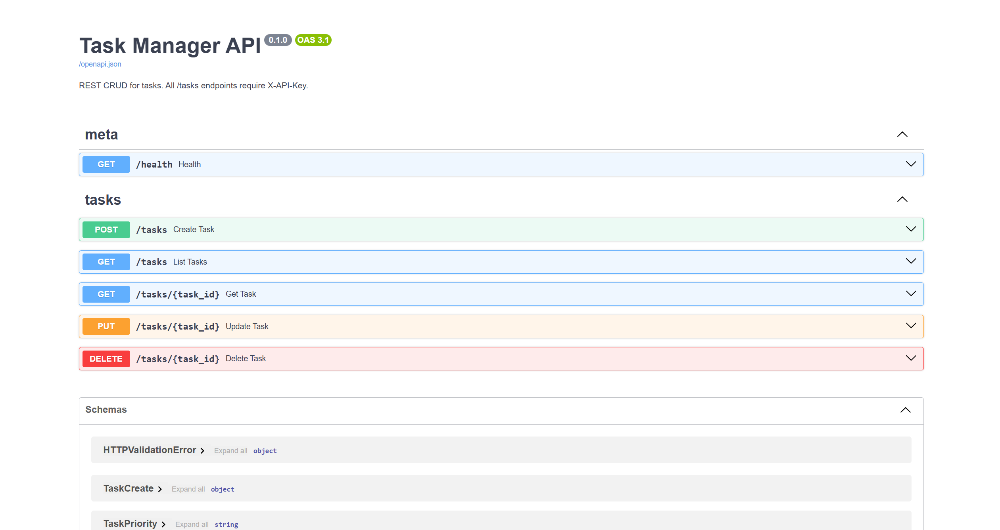
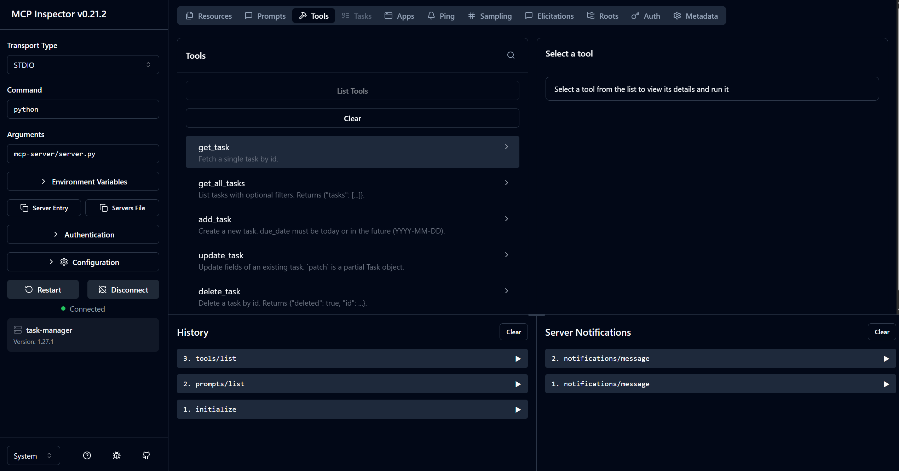

# Task Manager (AI-native, MCP-based)

A Task Manager you drive entirely through Claude Code.

```
Claude Code  ──MCP/stdio──▶  Python MCP server  ──HTTPS + X-API-Key──▶  FastAPI backend  ─▶  SQLite
```

**Why MCP and not direct HTTP?** Claude can discover tools / resources / prompts automatically, validate inputs against typed schemas, and keep the API key out of its own context. The same MCP server works in Claude Desktop, MCP Inspector, and any other MCP host.

## Repository layout

```
task-manager/
├── backend/                 FastAPI + SQLModel + SQLite
│   ├── app/                 main, models, schemas, auth, routers/tasks.py
│   └── tests/               pytest with TestClient (11 tests)
├── mcp-server/              FastMCP server
│   ├── server.py            entrypoint (stdio)
│   ├── api_client.py        single source of the X-API-Key
│   ├── tools/tasks_crud.py  add/get/update/delete + filtered list
│   ├── resources/           tasks://all, completed, today, in-progress
│   ├── prompts/             /daily-plan, /prioritize-tasks (MCP-level)
│   └── tests/               test_tools.py, test_tasks_crud.py
├── .claude/
│   ├── settings.json        wires the hooks
│   ├── skills/              /git-commit, /add-test
│   ├── agents/              code-reviewer, test-writer
│   └── commands/            /daily-plan, /prioritize-tasks (work in IDE plugin too)
├── hooks/
│   ├── precheck_secrets.py  PreToolUse — blocks secret leaks
│   ├── post_edit.ps1        PostToolUse — ruff + black + pytest (Windows)
│   └── post_edit.sh         POSIX mirror
├── docs/
│   └── images/              README screenshots
├── run_mcp.bat              wrapper to launch MCP server (sets env vars)
├── CLAUDE.md                Claude Code project conventions
├── TESTING.md               end-to-end verification checklist
└── README.md  (this file)
```

## Prerequisites

- Python **3.11+** (tested on 3.11, 3.14)
- Node + npx (only for MCP Inspector)
- [Claude Code](https://docs.claude.com/en/docs/claude-code) CLI v2.x
- `pip` (or `uv`) and `git`

## Installation (Windows / PowerShell)

```powershell
git clone <repo> task-manager
cd task-manager

python -m venv .venv
./.venv/Scripts/Activate.ps1

pip install -e ./backend[dev]
pip install -e ./mcp-server[dev]

Copy-Item backend\.env.example backend\.env
```

POSIX:
```bash
python3 -m venv .venv && source .venv/bin/activate
pip install -e ./backend[dev] -e ./mcp-server[dev]
cp backend/.env.example backend/.env
```

## Step 1 — Run the backend

Open the **first terminal** and run:

```powershell
cd C:\Work\task-manager
.\.venv\Scripts\Activate.ps1
$env:API_KEY = "dev-secret-123"
uvicorn app.main:app --reload --port 8000 --app-dir backend
```

Leave the process running. Verify: open <http://localhost:8000/docs>, click **Authorize**, and enter `dev-secret-123`.



*FastAPI Swagger UI: REST CRUD for tasks, every `/tasks` endpoint requires `X-API-Key`.*

Run the test suite (in a separate terminal with the venv activated):
```powershell
pytest -q backend/tests
```
Expected result: `11 passed`.

## Step 2 — Run the MCP server (direct launch)

Direct run for debugging (stdio, terminate with Ctrl+C):

```powershell
cd C:\Work\task-manager
.\.venv\Scripts\Activate.ps1
$env:API_KEY = "dev-secret-123"
$env:API_BASE_URL = "http://localhost:8000"
python mcp-server/server.py
```

> Or simply execute `run_mcp.bat` — it already wraps all env vars and the full path to the venv Python.

## Step 3 — Validate with MCP Inspector

> **Important for Windows:** MCP Inspector v0.21 mishandles Windows paths that start with `C:\` in the Arguments field — after JSON escaping the path is mangled (e.g. `C:\Work\task-manager\mcp-server\server.py` → `C:\Work\task-manager\Worktask-managermcp-serverserver.py`). The workaround is to use `python` as the command (without a path) and to prepend the venv to `PATH` before launching the Inspector.

Open a **new terminal** (the backend must already be running in another one):

```powershell
cd C:\Work\task-manager
.\.venv\Scripts\Activate.ps1
$env:PATH = "C:\Work\task-manager\.venv\Scripts;" + $env:PATH
$env:API_KEY = "dev-secret-123"
$env:API_BASE_URL = "http://localhost:8000"
& "C:\Program Files\nodejs\npx.cmd" "@modelcontextprotocol/inspector" python "mcp-server/server.py"
```

The Inspector prints a URL such as `http://localhost:6274/?MCP_PROXY_AUTH_TOKEN=...` and opens the browser automatically.

**In the browser:**
- The Command / Arguments fields are pre-filled (`python` / `mcp-server/server.py`) — **do not edit them**
- Click **Connect**



*MCP Inspector v0.21.2 shows `task-manager` (Version 1.27.1) Connected. The Tools tab lists all 5 tools.*

### Inspector verification checklist

**Tools tab** — call each tool:
1. `add_task` → `{"title": "Test task", "priority": "high"}` — should return an object with an `id`
2. `get_task` → `{"id": <id from step 1>}` — should return the same object
3. `get_all_tasks` → `{"status": "todo"}` — should contain the new task
4. `update_task` → `{"id": <id>, "patch": {"status": "done"}}` — status updated
5. `delete_task` → `{"id": <id>}` — returns `{"deleted": true}`; a subsequent `get_task` returns 404

**Resources tab** — read each resource:
- `tasks://all` — all tasks
- `tasks://completed` — only `status=done`
- `tasks://today` — open tasks due today or overdue
- `tasks://in-progress` — only `status=in_progress`

**Prompts tab:**
- `daily-plan` — the prompt body should reference resources
- `prioritize-tasks` — the prompt body should describe the sorting rules

**Negative test:** in the Inspector terminal, override `$env:API_KEY = "wrong"` and click Connect — every tool call must surface a 401 error.

> The full checklist for every layer of the system (tools / resources / prompts / skills / agents / hooks / validation) lives in [`TESTING.md`](./TESTING.md).

## Step 4 — Connect to Claude Code

```powershell
cd C:\Work\task-manager
claude mcp add task-manager `
  --env API_KEY=dev-secret-123 `
  --env API_BASE_URL=http://localhost:8000 `
  -- C:/Work/task-manager/.venv/Scripts/python.exe C:/Work/task-manager/mcp-server/server.py
```

> **Important:** run the command from inside `C:\Work\task-manager` and pass the **full path to the venv Python** — otherwise Claude Code falls back to the system Python, which does not have `mcp` installed.

Verify the connection:
```powershell
claude mcp list
```
Expected output: `task-manager: ... - ✓ Connected`.

Open the project in Claude Code and run `/mcp` — `task-manager` should appear. Try:

- *"Add a task to write the weekly report by Friday, high priority."*
- *"What should I focus on today?"*
- `/daily-plan` or `/prioritize-tasks` (project-level slash commands)
- In the main CLI terminal you can also use the full MCP form `/mcp__task-manager__daily-plan`

> **Claude Code IDE extension (VS Code / JetBrains):** MCP prompts with the `/mcp__...` prefix may not be recognized as slash commands inside the IDE — only inside the main CLI. The repo therefore mirrors them as project-level commands in `.claude/commands/daily-plan.md` and `.claude/commands/prioritize-tasks.md`, which work in every Claude Code surface.

## Development workflow

1. `.\.venv\Scripts\Activate.ps1`
2. Edit `.py` files. The **PostToolUse** hook automatically runs `ruff --fix`, `black`, and the relevant `pytest` suite.
3. After adding a new function, run `/add-test path/to/file.py::name`. The `test-writer` sub-agent generates the pytest file and the post-edit hook executes it.
4. Stage your changes (`git add <paths>`) and run `/git-commit`. The skill invokes the `code-reviewer` sub-agent and, on approval, creates a Conventional Commits commit.

The **PreToolUse** hook (`hooks/precheck_secrets.py`) blocks any edit that would write a literal API key, AWS key, GitHub PAT, or private key into a file. Read configuration through `os.getenv("API_KEY", "dev-secret-123")` instead.

## Troubleshooting

| Symptom | Cause | Fix |
| --- | --- | --- |
| MCP Inspector: mangled path (e.g. `Worktask-manager...`) | Inspector v0.21 mishandles Windows paths starting with `C:\` | Prepend the venv to `$env:PATH` and use `python` + relative path as shown in Step 3 |
| `401 Missing or invalid API key` from MCP tools | `API_KEY` is unset or does not match the backend | Set the same value in both terminals |
| `tasks://today` returns an empty array | All open tasks have no `due_date` or are already `done` | Add a task with a `due_date` today or in the past (use PUT — POST rejects past dates) |
| `claude mcp list` reports `Failed to connect` | Claude Code uses the system Python without `mcp` installed | Pass the full venv path: `C:/Work/task-manager/.venv/Scripts/python.exe` |
| `task-manager` is missing from `/mcp` in Claude Code | `claude.json` stores the project key with forward slashes (`/`) from `claude mcp add`, while Claude Code looks it up with backslashes (`\`) | Run `claude mcp add` from the correct directory. If the issue persists, edit `C:\Users\<user>\.claude.json` and move the `mcpServers` block from the `C:/Work/task-manager` key into `C:\\Work\\task-manager` |
| `/daily-plan` is not recognized in the IDE | The Claude Code IDE extension does not expose MCP prompts as slash commands | Use the project-level commands in `.claude/commands/` (no prefix) or ask Claude in natural language |
| The pre-edit hook blocks a legitimate write | Pattern false-positive | Read from `os.getenv(...)`; the allowlist already covers that idiom |
| `pytest` is not invoked by the post-edit hook | Dev tools are not installed in the active venv | `pip install -e ./backend[dev] -e ./mcp-server[dev]` |

## License

MIT (or whichever the assignment specifies).
